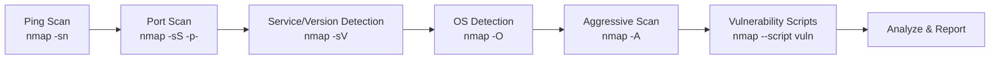

# 🔎 Nmap Vulnerability Scanning Project


---

## 🎯 Project Objective
Demonstrate the use of **Nmap** as a vulnerability scanning tool against a local host (`192.168.29.99`). Identify **open ports, services, OS**, and **potential vulnerabilities** using Nmap scans and NSE scripts.

---

## 🧩 Target Information
- **Target IP:** `192.168.29.99`  
- **Assumption:** Private lab machine with intentionally vulnerable services for testing.

---

## 🛠️ Tools Used
- **OS:** Kali Linux  
- **Tool:** Nmap (v7.94 or latest)  
- **Optional GUI:** Zenmap (visualization)

---

## 🧭 Workflow (Mermaid Diagram)

> This workflow moves from **host discovery** to **deep service analysis** and **vulnerability detection**.

---

## 🧪 Step-by-Step Process & Commands

### 1) Host Discovery – Ping Scan
```bash
nmap -sn 192.168.29.99
```

### 2) Full TCP Port Scan
```bash
nmap -sS -p- 192.168.29.99
```

### 3) Service & Version Detection
```bash
nmap -sV 192.168.29.99
```

### 4) Operating System Detection
```bash
nmap -O 192.168.29.99
```

### 5) Aggressive (All‑in‑One) Scan
```bash
nmap -A 192.168.29.99
```

### 6) Vulnerability Scan with NSE
```bash
nmap --script vuln 192.168.29.99
```

> 💡 Tip: Add `-oN scan.txt` to save output, e.g., `nmap -A 192.168.29.99 -oN nmap_agg.txt`.

---

## 🧾 Sample Scan Output Summary *(Fictional Example)*
```
PORT     STATE SERVICE     VERSION
21/tcp   open  ftp         vsftpd 2.3.4
22/tcp   open  ssh         OpenSSH 7.2p2
80/tcp   open  http        Apache httpd 2.4.18
139/tcp  open  netbios-ssn Samba smbd 3.X - 4.X

Host script results:
| ftp-vsftpd-backdoor: Vulnerable version detected!
| http-dombased-xss: Potential DOM-based XSS vulnerability found.
| smb-vuln-ms17-010: VULNERABLE: EternalBlue
```

---

## 🔍 Result Analysis
- **FTP (vsftpd 2.3.4):** Known backdoor vulnerability → **critical** exposure.  
- **HTTP (Apache 2.4.18):** Possible **DOM‑based XSS** indicated by NSE script.  
- **SMB (MS17‑010/EternalBlue):** Remote code execution risk → **critical**.

---

## ✅ Recommendations
- **Upgrade** or **patch** vulnerable services (vsftpd, Apache, Samba).  
- Apply **OS & security updates** regularly.  
- **Restrict** sensitive ports via firewall / security groups.  
- Enforce **least privilege**, disable unused services.  
- Schedule **periodic scans** and integrate results into **vulnerability management** workflows.

---

## 📦 Artifacts & Deliverables
- Nmap outputs (`-oN`, `-oX`, or `-oG`) for each scan type.  
- Short report summarizing **open ports, services, vulnerabilities, and remediation**.  
- Optional: Zenmap topology and comparison of scans over time.

---

## 🧠 Notes & Good Practices
- Run targeted NSE scripts for specific services, e.g.:  
  ```bash
  nmap -p 445 --script smb-vuln* 192.168.29.99
  nmap -p 80  --script http*      192.168.29.99
  ```
- Use `--min-rate` and `-T` profiles carefully to balance **speed vs. accuracy**.  
- Always test in a **legal, controlled lab environment**.

---

## 🏁 Conclusion
While Nmap is primarily a **port scanner**, pairing it with **service detection** and **NSE scripts** turns it into a lightweight **vulnerability assessment** tool—ideal for quickly spotting **misconfigurations** and **outdated services** in lab environments.
